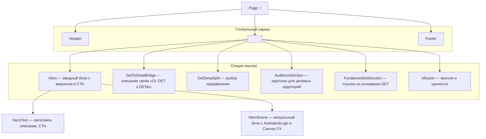

# components/

Глобальные UI-компоненты проекта: примитивы, блоки страниц и визуальные эффекты, которые переиспользуются на разных маршрутах.

## sections/

Крупные блоки страниц (Hero, Features, Products), собирающие примитивы из `ui/` в готовые секции.

### Карта страниц → секций

| Страница              | Секции                                                                                      | Описание                                                                                            |
| --------------------- | ------------------------------------------------------------------------------------------- | --------------------------------------------------------------------------------------------------- |
| Главная (/)           | Hero, DetToDetaiBridge, DetDetaiSplit, AudienceSection, FundamentDetSection, Mission | Основная смысловая и визуальная точка входа в экосистему DET / DETai                                |
| Цвета DETai (/colors) | —                                                                                           | Временная служебная страница для просмотра и проверки основных цветов сайта                         |
| Contacts (/contacts)  | —                                                                                           | Контактная информация и способы связи                                                               |
| Team (/team)          | —                                                                                           | Страница с информацией о команде и ключевых участниках                                              |
| Неиспользуемые        | Projects                                                                                    | Здесь будет описание DETai как системы Umbrella и карточки, ведущие на подстраницы для каждого проекта |

### Главная страница — блоки и порядок

## ui/

Библиотека атомарных элементов (кнопки, поля ввода, карточки, иконки). Используются в любых секциях и страницах. Подробное описание микрочастиц — в [components/ui/README.md](./ui/README.md).

### Карта секций → ui-компонентов

| Секция | ui-компоненты |
| --- | --- |
| Hero | Button, Heading, Section |
| DetToDetaiBridge | Heading, Section |
| DetDetaiSplit | Button, Heading, Section |
| AudienceSection | Heading, Section |
| FundamentDetSection | Button, Heading, Section |
| Mission | Heading, Section |
| Projects | Heading, Section |
| HeroScene | — |
| Неиспользуемые | Card / CardHeader / CardTitle / CardDescription / CardContent / CardFooter (card.tsx), Input, Textarea |

## layout/

Компоненты каркаса сайта: Header, Footer и обёртки для страниц. Формируют общую навигацию и сетку.

## visual/

Компоненты визуального слоя Hero-сцены: Lottie-анимации, Canvas-эффекты и логика их синхронизации.

### Состав

| Компонент | Файл | Назначение |
|---------|------|-----------|
| Animated logo wrapper | [`AnimatedLogo.tsx`](./visual/AnimatedLogo.tsx) | Переключение Lottie: intro → loop |
| Canvas · Local FX | [`CanvasLocalParticlesLayer.tsx`](./visual/CanvasLocalParticlesLayer.tsx) | Локальный слой частиц, привязанный к контейнеру |
| Canvas · Global FX | [`CanvasGlobalParticlesLayer.tsx`](./visual/CanvasGlobalParticlesLayer.tsx) | Глобальный слой частиц относительно viewport |
| Canvas · Pulse FX | [`CanvasPulseLightLayer.tsx`](./visual/CanvasPulseLightLayer.tsx) | Подсветка, дыхание пульса |

💡 Перспектива оптимизации: при росте числа Canvas-эффектов целесообразно вынести общую логику управления жизненным циклом (visibility / viewport / pause-resume) в единый инфраструктурный util или кастомный hook (например, useCanvasLifecycle).

### Связанные ресурсы

- Lottie-файлы и статические ассеты лежат в [`public/assets`](../public/assets/README.md#animations).
- Canvas-эффекты опираются на анимации из `visual/` и синхронизируются через общий Hero-контейнер.

💡 Canvas-эффекты можно накладывать на любые элементы например **Кнопки Button.tsx** или **карточки**
